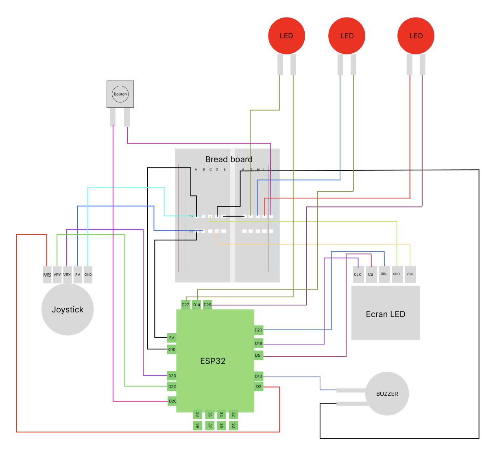
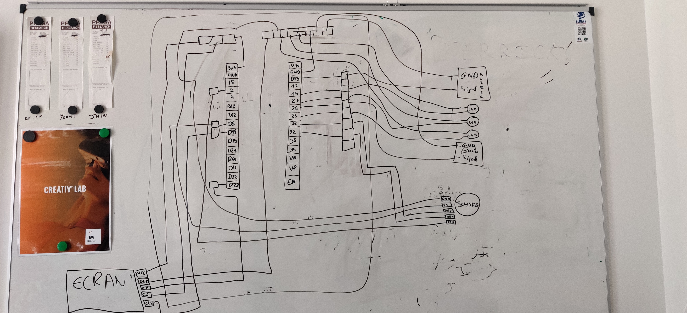
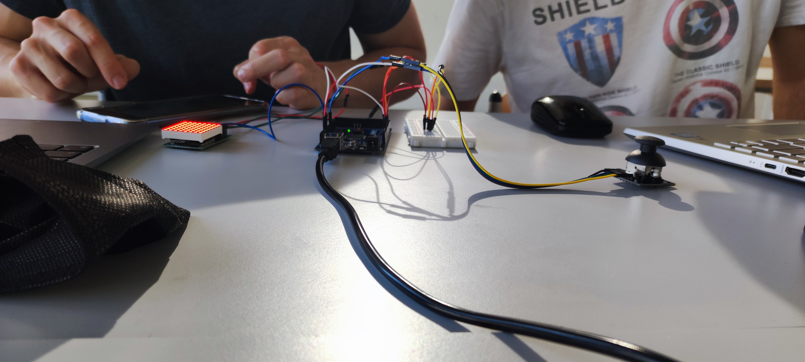
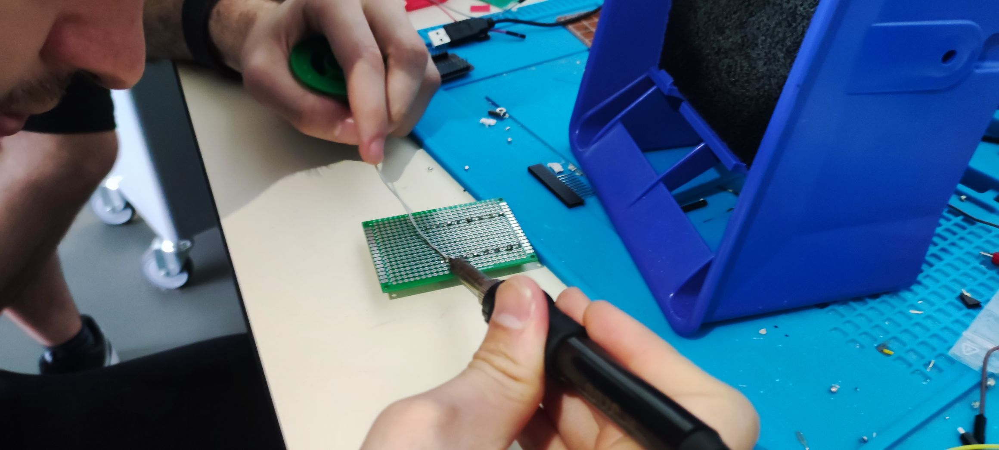
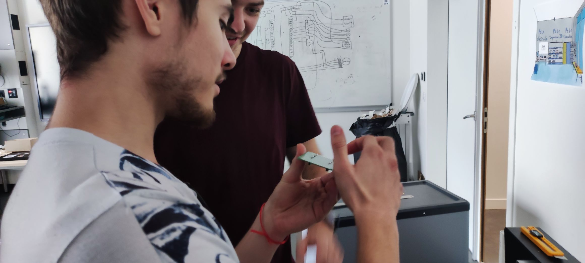
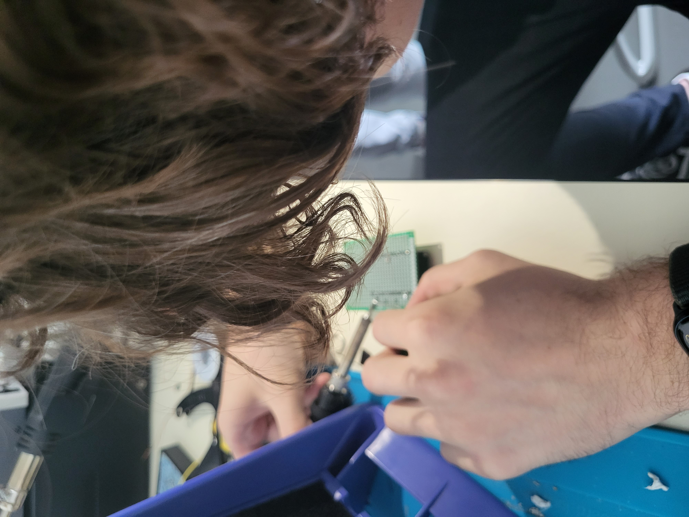
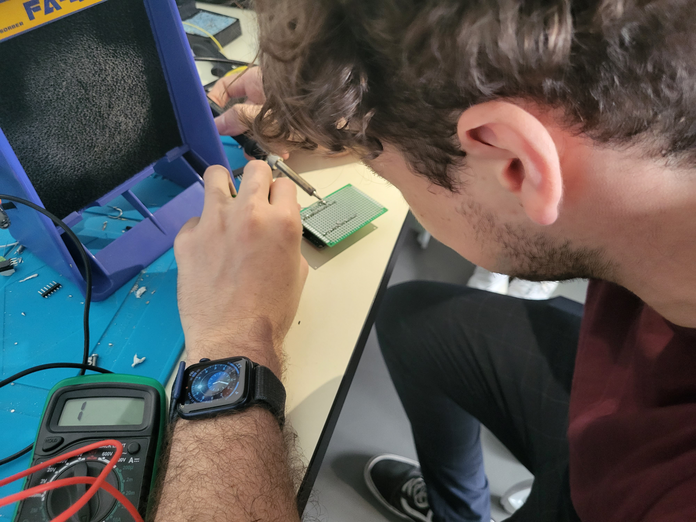

## DVIC IIM GROUP GAME BOO

### Project description: 

This project is collaborative project of a snake game developed in C++ working on an ESP32.
The purpose was to recreate a snake with basic component to display it on a small 8 by 8 led screen.
The only rule was to be able to fit all the component in a small 3d printed box. And to have fun !

### Get started: 

- Download the project
- Open Visual Studio Code
- Install the extension [PlatformIo](https://platformio.org/)
- Open the folder with the extension
- Build the project
- Plug the Game Boo to your computer
- And have fun !

### Sketch: 

Sketch of the project:

Drawing of the sketch of the project:

One of the prototype of the box: 

### Features

This game has plenty of small features: 

- 8x8 screen led
- multidimensional playable joystick
- an end game timer
- sound effect
- a compact and pretty box
- random spawn point
- displaying score after the game over

### Components 

- ESP32: 1
- Buzzer: 1
- Led screen 8x8: 1
- Joystick: 1
- Button: 1
- Red led: 3
- Wires: 24

### What's next ?

For the moment the game is still in beta, we plan to add a tone of new features. 
Fill free to propose some new ideas, but there is a list of the next features we will add:

- health point
- increase speed at each level 
- timer upgrade 
- new sound effect
- upgrade the box and the controller
- level system

### Conceptions
Conception of the project

### Teams

The team:

<table>
    <tr>
        <td align="center">
            <a href="https://github.com/Mario2206">
                 
                <b>Mathieu Raimbault</b>
            </a>
        </td>
        <td align="center">
            <a href="https://github.com/Ericar974">
                 
                <b>Armand Dorard</b>
            </a>
        </td>
        <td align="center">
            <a href="https://github.com/CanberraMenthonnex">
                 
                <b>Canberra Menthonnex</b>
            </a>
        </td>
        <td align="center">
            <a href="https://github.com/SGJipe">
                 
                <b>Jean Pierre Han</b>
            </a>
        </td>
        <td align="center">
            <a href="https://github.com/arcausin">
                 
                <b>Alexis D'Ambrosio</b>
            </a>
        </td>
</table>